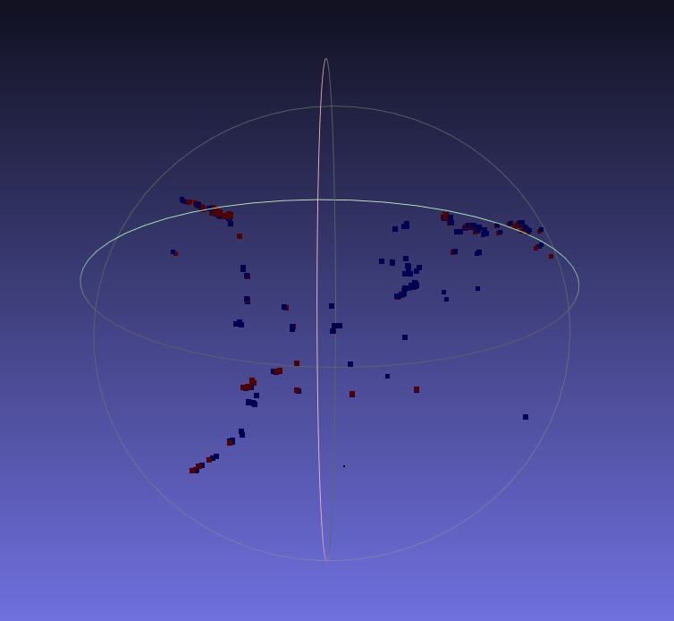

# Incremental-SfM

This repo contains my custom structure from motion pipeline written in C++. Currently only supports two-view triangulation with bundle adjustment, but I plan to build up towards a complete incremental SfM system.
The goal is to learn the principles of multi-view geometry by writing my own SfM pipeline so that I can later apply it to problems like visual odometry and SLAM. 


## Requirements

* Eigen
* OpenCV 
* g2o
* PCL

## Build

```
git clone https://github.com/ragibarnab/incremental-sfm.git
cd incremental-sfm
mkdir build
cd build
cmake ..
make
```

## Programs

### two_view_triangulation

A demonstration of triangulating corresponding points in two separate images. Code in this program will be used in the future to build out the system. Things learned along the way:

* detect/compute features
* match features to find correspondences
* find essential matrix
* estimate the relative pose between the images from the essential matrix
* triangulating the 3D points from the 2D point correspondences and initial pose estimate
* apply bundle adjustment (BA) using g2o, a framework for graph-based nonlinear optimization, in order to finetune the 3D point estimates and camera poses

The output of the program will just be a .ply file containing the triangulated points before and after BA in MeshLab: 



The blue points are before BA and red after. Honestly, it's hard to make out a structure with the points from just two views. Also, since it's just two views, the reprojection error is already quite low, so BA does not really lower it by a huge margin. But learning how to do all these steps is useful since they are the essentially the same for multi-view settings. We just perform these steps for each sequential pair of images, and build a map by finding poses between pairs using PnP.